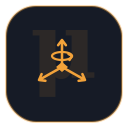

<h1 align="center">
  <br>
  xmMu&nbsp;·&nbsp;μ
</h1>

<p align="center"><b>Host hardware drivers for the xMotion family</b><br>
The μ layer that talks to motors, sensors and radios over serial, CAN and Modbus.</p>

---

`xmMu` is the μ hardware-driver layer of the **xMotion** product family. It provides host-side
drivers for the physical devices a robot is built from: brushed/brushless motor controllers and
servos (over serial, CAN and Modbus-RTU), inertial measurement units, and RC / human-input
devices (SBUS receivers, joysticks and keyboards). Each driver is a small, independently linkable
module built against the interfaces defined by [xmSigma](https://github.com/rxdu/xmSigma).

> Part of the xMotion family — see the [umbrella](https://github.com/rxdu/xmotion). Sibling
> components include [xmSigma](https://github.com/rxdu/xmSigma) (foundation: interfaces, logging,
> common types) and [xmNabla](https://github.com/rxdu/xmNabla) (motion algorithms).

## Modules

| Module                        | Description                                                                 |
|-------------------------------|-----------------------------------------------------------------------------|
| `src/hal`                     | App-facing device HAL: `Device`/`Motor`, capability mixins, `Status`/`Result<T>`, units, `MotorFactory`, freshness, IMU/RC/joystick/keyboard interfaces |
| `src/transport/async_port`    | Asynchronous serial and CAN ports (asio) on one shared io_context, bounded TX, health |
| `src/transport/modbus_rtu`    | Modbus-RTU port wrapper built on libmodbus (RAII)                           |
| `src/devices/motor_akelc`     | AKELC motor controller driver (Modbus) — `hal::Motor`, factory type `akelc` |
| `src/devices/motor_vesc`      | VESC motor controller driver over CAN — `hal::Motor`, factory type `vesc`   |
| `src/devices/motor_waveshare` | Waveshare DDSM-210 hub motors and SMS/STS bus servos — types `ddsm210`/`sms_sts` |
| `src/devices/motor_registry`  | `RegisterAllMotors()` — one-call factory registration of every bundled motor |
| `src/devices/sensor_imu`      | HiPNUC serial IMU driver — `hal::Imu`                                        |
| `src/devices/input_hid`       | Joystick and keyboard input over libevdev — `hal::Joystick` / `hal::Keyboard` |
| `src/devices/input_sbus`      | SBUS RC receiver decoder and driver — `hal::RcReceiver` (first-party decoder) |

## Dependency on xmSigma

xmMu builds on **xmSigma** (CMake package name `xmotion-core`), which provides the
`xmotion::interface` and `xmotion::logging` targets. The build resolves it in one of two ways:

1. **Installed** — if `find_package(xmotion-core)` succeeds, that installation is used.
2. **Bundled** — otherwise the build falls back to the `third_party/xmSigma` submodule.

Initialise the submodules before configuring:

```bash
git submodule update --init --recursive
```

## Build

```bash
mkdir build && cd build
cmake .. -DCMAKE_BUILD_TYPE=Release
cmake --build . -j
```

Key options: `BUILD_TESTING` (build tests, default `OFF`), `STATIC_CHECK` (cppcheck, default
`OFF`), `XMOTION_DEV_MODE` (force-build tests, default `OFF`).

### System dependencies

The driver modules link a handful of system libraries (install via apt on Ubuntu):

```bash
sudo apt-get install libasio-dev libmodbus-dev libevdev-dev
```

Consumers use the aggregate target to pull in every driver module:

```cmake
find_package(xmMu REQUIRED)
target_link_libraries(my_app PRIVATE xmotion::xmMu)
```

Individual modules are also exported (e.g. `xmotion::motor_vesc`, `xmotion::sensor_imu`).

## Provenance

This code was extracted from the `src/driver` tree of `libxmotion` / `xmNabla` and repackaged as
a standalone, independently versioned component of the xMotion family.

## License

Apache-2.0 — see [LICENSE](LICENSE) and [NOTICE](NOTICE). First-party code only; bundled
third-party components (e.g. `third_party/googletest`) and vendored device protocols (SCServo,
ch_serial) retain their own licenses.
